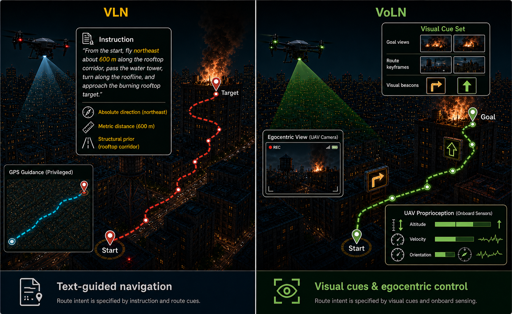
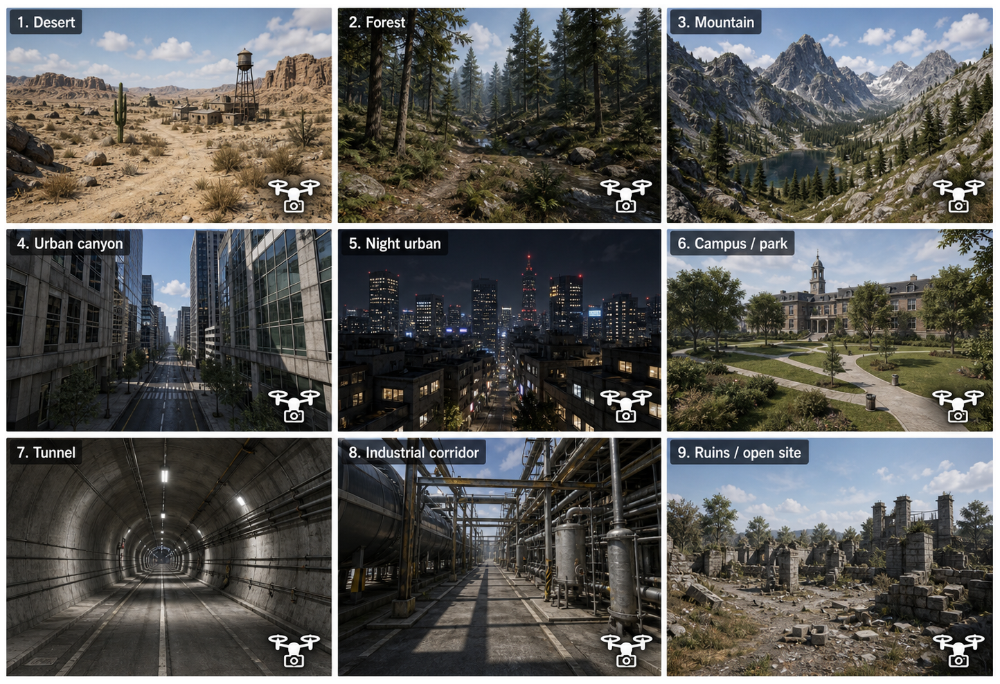
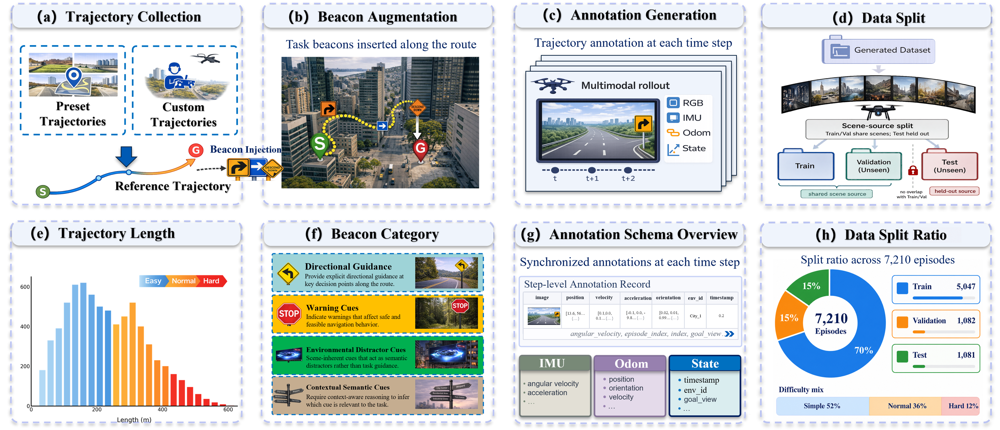
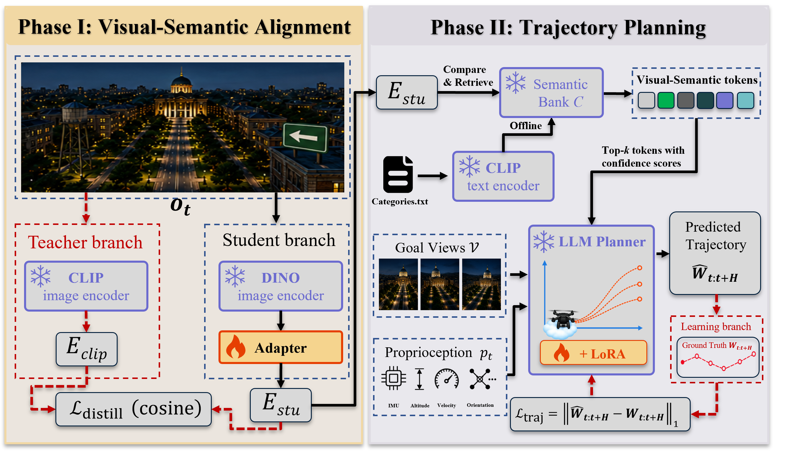
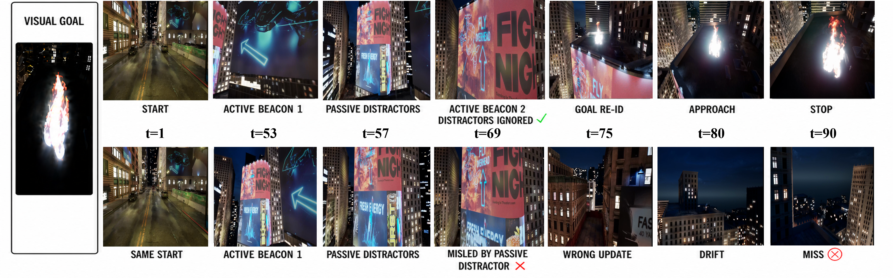
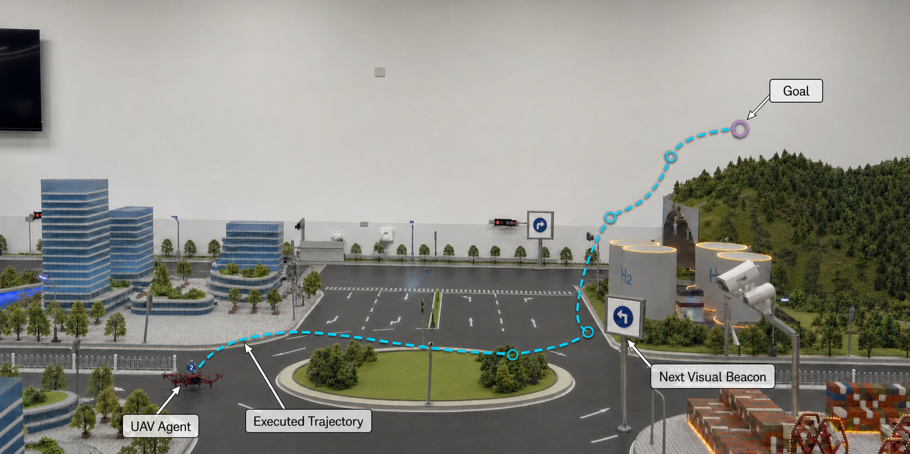

# VoLN: Vision-Only Language-Model-Oriented Navigation

### VoLN-UAV benchmark and VoLN-MLLM

[Project Page](https://admire-ljb.github.io/VoLN-UAV/) ·
[Paper](paperv1.pdf) ·
[Dataset](https://huggingface.co/datasets/Louj/VoLN-UAV-dataset) ·
[Simulator Environments](https://huggingface.co/datasets/Louj/VoLN-UAV-ENV) ·
[Documentation](docs/voln_adapted_baselines.md)

  

## Overview

VoLN studies long-horizon UAV navigation when route intent is specified without episode-level language instructions. At each decision step, the agent receives an egocentric RGB observation, its observation history, proprioception, and terminal goal views. Route guidance must be recovered from visual beacons embedded in the environment. Text instructions, GPS, global maps, symbolic goal coordinates, and shortest-path supervision are unavailable during execution.

This repository contains:

- the **VoLN-UAV** benchmark construction and scene-disjoint evaluation pipeline;
- the **VoLN-MLLM** visual-semantic alignment and trajectory-planning method;
- VoLN-adapted **Seq2Seq-VG**, **CMA-VG**, and **LAG-VG** baselines;
- offline and AirSim closed-loop evaluation with NE, SR, OSR, nDTW, SPL, CT, and EER;
- dataset packaging, beacon augmentation, route replay, and simulator utilities.

## News and Resources

- **Dataset:** [Louj/VoLN-UAV-dataset](https://huggingface.co/datasets/Louj/VoLN-UAV-dataset)
- **Simulator environments:** [Louj/VoLN-UAV-ENV](https://huggingface.co/datasets/Louj/VoLN-UAV-ENV)
- **Interactive demonstrations:** [Project page](https://admire-ljb.github.io/VoLN-UAV/#demonstrations)
- **Current manuscript:** [PDF](paperv1.pdf)

The navigation dataset and simulator packages are released separately. The dataset repository provides sharded source trajectories, RGB observations, metadata, and split files; the environment repository provides the Unreal Engine/AirSim packages.

## VoLN-UAV Benchmark

  

The current manuscript defines **7,210 benchmark episodes** with scene-level disjoint splits:

| Split | Episodes | Ratio | Evaluation name |
|---|---:|---:|---|
| Train | 5,047 | 70% | Train |
| Validation | 1,082 | 15% | Validation-Unseen |
| Test | 1,081 | 15% | Test-Unseen |

Difficulty is determined by reference path length:

- **Easy:** less than 300 m
- **Normal:** 300–450 m
- **Hard:** at least 450 m

  

The benchmark combines preset trajectories and operator-collected routes, injects task-relevant active beacons, retains passive semantic distractors, and records synchronized RGB, IMU, odometry, state, goal-view, and future-waypoint supervision. Splitting is performed at the Unreal-scene level to prevent scene leakage.

## VoLN-MLLM

  

VoLN-MLLM has two stages:

1. **Visual-semantic alignment.** A lightweight adapter maps frozen DINOv3 ViT-B/16 features into the frozen CLIP ViT-B/16 image-embedding space using cosine distillation.
2. **Trajectory planning.** A six-layer Transformer planner combines the aligned observation, terminal goal views, proprioception, and top-8 tokens retrieved from a 300-entry semantic bank. LoRA rank-16 adapters specialize the planner to predict eight 3D waypoints and a stop signal.

## Main Results

Test-Unseen results from the current manuscript are shown below. Each entry is ordered as **Easy / Normal / Hard**; arrows indicate whether lower or higher is better.

| Method | NE (m) ↓ | SR (%) ↑ | OSR (%) ↑ | nDTW (%) ↑ | SPL (%) ↑ |
|---|---:|---:|---:|---:|---:|
| Random | 270.1 / 310.4 / 395.2 | 0.4 / 0.0 / 0.0 | 1.4 / 0.6 / 0.2 | 30.1 / – / – | 0.3 / 0.0 / 0.0 |
| Seq2Seq-VG | 208.6 / 254.8 / 309.9 | 1.0 / 0.4 / 0.1 | 4.8 / 2.5 / 0.9 | 28.9 / 21.4 / 13.0 | 0.7 / 0.3 / 0.0 |
| CMA-VG | 174.5 / 216.8 / 266.1 | 1.6 / 0.8 / 0.2 | 6.5 / 3.9 / 1.7 | 33.2 / 26.4 / 18.5 | 1.1 / 0.6 / 0.1 |
| LAG-VG | 122.4 / 158.3 / 206.7 | 2.3 / 1.2 / 0.4 | 6.4 / 3.8 / 1.7 | 28.1 / 20.5 / 14.0 | 1.5 / 0.7 / 0.2 |
| **VoLN-MLLM** | **97.1 / 131.4 / 176.8** | **7.4 / 4.5 / 1.8** | **14.6 / 10.1 / 4.5** | **53.1 / 41.2 / 28.0** | **5.7 / 3.2 / 1.3** |

The trained baselines are visual-goal adaptations of instruction-following navigation models. All methods receive the same VoLN observations and share waypoint supervision, action interface, stopping rule, and evaluation protocol.

## Qualitative Results

  

The aligned rollouts show the key VoLN failure mode: an agent must select the active route beacon while ignoring visually similar passive distractors. Selecting the wrong cue produces an incorrect local update, accumulated drift, and a missed goal.

  

The physical indoor testbed is a preliminary qualitative feasibility study under the same visual-goal interface; it is not presented as a large-scale quantitative real-world benchmark.

## Visual Demonstrations

<table>
<tr>
<td align="center" width="50%">
<strong>Simulation</strong> 
 
<a href="https://admire-ljb.github.io/VoLN-UAV/#simulation-demo">Open web player</a>
</td>
<td align="center" width="50%">
<strong>Physical flight</strong> 
 
<a href="https://admire-ljb.github.io/VoLN-UAV/#physical-flight-demo">Open web player</a>
</td>
</tr>
</table>

## Installation

~~~bash
conda create -n voln-uav python=3.10 -y
conda activate voln-uav
pip install -r requirement.txt
pip install -e .[real]
~~~

Install the CUDA-specific PyTorch build first if the default wheel does not match your system.

## Dataset Preparation

Download the [navigation dataset](https://huggingface.co/datasets/Louj/VoLN-UAV-dataset) and extract the metadata and required split shards into one directory. Download the [simulator environments](https://huggingface.co/datasets/Louj/VoLN-UAV-ENV) separately for online AirSim evaluation.

Set <code>source_root</code> and <code>output_root</code> in <code>configs/benchmark_dataset_release.yaml</code>, then build the benchmark:

~~~bash
python -m voln_uav.cli.build_benchmark --config configs/benchmark_dataset_release.yaml
~~~

## Training

Run the complete real-data pipeline:

~~~bash
python scripts/run_dataset_release_pipeline.py --device cuda
~~~

Run selected stages when resuming or debugging:

~~~bash
python scripts/run_dataset_release_pipeline.py --stages build train-adapter train-planner offline-eval --device cuda
~~~

The VoLN-adapted baselines have separate training entry points and checkpoints. See [baseline documentation](docs/voln_adapted_baselines.md) for Seq2Seq-VG, CMA-VG, and LAG-VG.

## Evaluation

Offline evaluation:

~~~bash
python -m voln_uav.cli.eval_offline --config configs/eval_offline_dataset_release.yaml --device cuda
~~~

AirSim preflight and closed-loop evaluation:

~~~bash
python -m voln_uav.cli.eval_airsim --config configs/eval_airsim_dataset_release.yaml --preflight
python -m voln_uav.cli.eval_airsim --config configs/eval_airsim_dataset_release.yaml --device cuda
~~~

On Windows, the reference and random online baselines can be evaluated with the same launcher:

~~~powershell
cd D:\VoLN_dataset\github-VoLN-UAV
$env:BASELINE="reference"
$env:TRIALS="10"
.\scripts\run_online_baseline.cmd --episode-index 0 --episode-stride 1 --reference-stride 1 --control-mode teleport --fast-reset --settle-sec 0.0 --work-dir D:\VoLN_dataset\VoLN-UAV-runs\reference_test_10_fast
~~~

Use <code>scripts\report_metrics.cmd</code> to summarize a run directory with the paper metrics.

## Repository Structure

~~~text
src/voln_uav/
  benchmark/      Benchmark construction, visual goals, and beacon augmentation
  data/           Dataset loaders and release packaging
  models/         DINO–CLIP adapter, semantic bank, planners, and LoRA modules
  training/       Adapter/planner training and DAgger-style collection
  evaluation/     Offline and online metrics
  simulators/     Route replay and AirSim interfaces
  cli/            Command-line entry points
configs/          Dataset, training, and evaluation configurations
scripts/          Reproducible training and evaluation launchers
airsim_plugin/    Unreal/AirSim scene utilities
docs/             Project page, demonstrations, and baseline documentation
~~~

## Citation

The manuscript is currently under review. Final bibliographic metadata will be added after the review period. Until then, please cite the project by its title, **“VoLN: Vision-Only Language-Model-Oriented Navigation,”** and link to this repository.

## Acknowledgement

We thank the authors of TravelUAV and AirVLN for releasing their codebases and providing useful engineering references for UAV navigation research.
