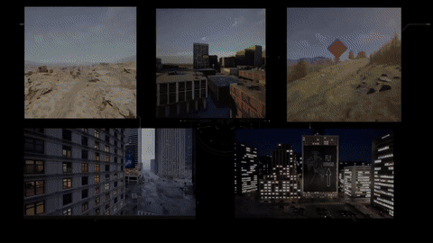
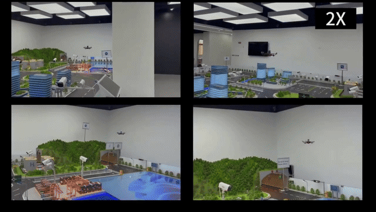
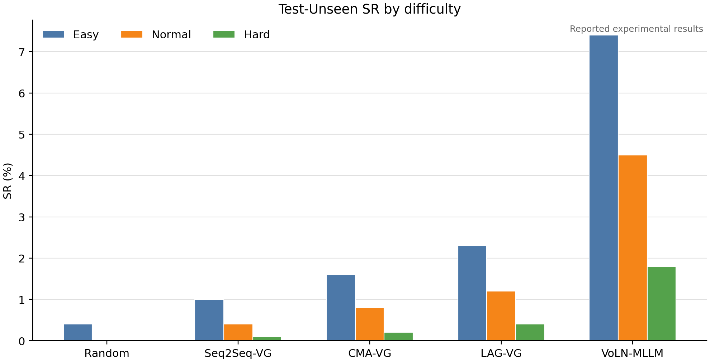
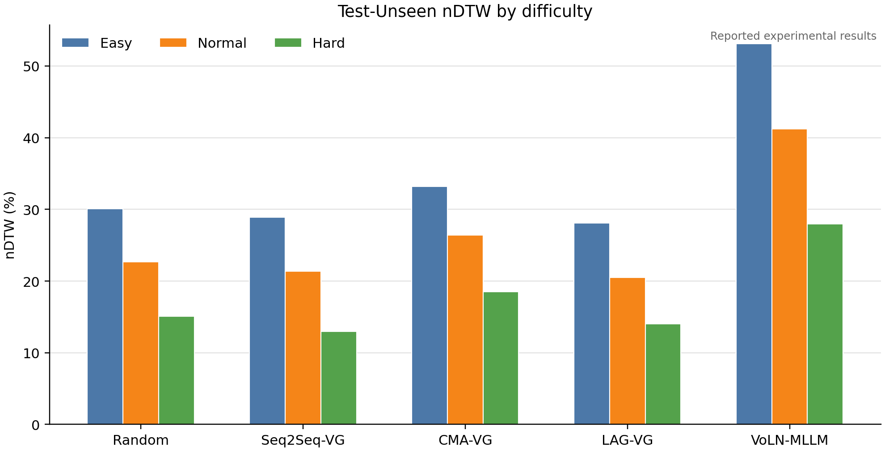

<strong>中文</strong> · <a href="./README.md">English</a>

# VoLN：纯视觉长程导航——范式、基准与方法

  <a href="https://admire-ljb.github.io/VoLN-UAV/">🌐 <strong>项目主页</strong></a>
  &nbsp;&nbsp;·&nbsp;&nbsp;
  <a href="https://arxiv.org/pdf/2607.21400">📄 <strong>论文</strong></a>
  &nbsp;&nbsp;·&nbsp;&nbsp;
  <a href="https://huggingface.co/datasets/Louj/VoLN-UAV-dataset">🤗 <strong>数据集</strong></a>
  &nbsp;&nbsp;·&nbsp;&nbsp;
  <a href="https://huggingface.co/datasets/Louj/VoLN-UAV-ENV">🧭 <strong>仿真环境</strong></a>

## 可视化演示

<table>
  <tr>
    <th width="50%">仿真第一视角</th>
    <th width="50%">真机第一视角</th>
  </tr>
  <tr>
    <td></td>
    <td></td>
  </tr>
</table>

## 复现范围

本 README 面向 VoLN 训练与评估代码的复现。方法概览、主要结果、数据集可视化、定性案例以及仿真与真机视频请访问[项目主页](https://admire-ljb.github.io/VoLN-UAV/)。

本仓库包含：

- VoLN-MLLM 视觉适配器与规划器训练；
- 适配 VoLN 任务的 Seq2Seq-VG、CMA-VG 和 LAG-VG 基线；
- AirSim 闭环基准评估与离线路径回放诊断；
- No-Align、No-LoRA 和 CLIP-Input 消融实验；
- NE、SR、OSR、nDTW、SPL、CT 和 EER 指标统计。

[导航数据集](https://huggingface.co/datasets/Louj/VoLN-UAV-dataset)和[仿真环境](https://huggingface.co/datasets/Louj/VoLN-UAV-ENV)独立发布，不在本仓库中重复存储。

## 实验协议

### 数据划分

论文使用 **7,210 个 episodes**。Validation-Seen 包含来自训练环境池中 5 个环境、且与训练轨迹不重叠的轨迹；Test-Unseen 包含 5 个未见环境：

| 数据划分 | Episodes | 比例 | 评估名称 |
|---|---:|---:|---|
| Train | 5,047 | 70% | Train |
| Validation-Seen | 1,082 | 15% | Validation-Seen |
| Test-Unseen | 1,081 | 15% | Test-Unseen |

难度按照参考轨迹长度划分：

- **Easy：** 小于 300 m
- **Normal：** 300–450 m
- **Hard：** 不小于 450 m

### 模型阶段

VoLN-MLLM 包含两个阶段：

1. **视觉—语义对齐。** 轻量适配器使用余弦蒸馏，将冻结的 DINOv3 ViT-B/16 特征映射到冻结的 CLIP ViT-B/16 图像嵌入空间。
2. **轨迹规划。** 冻结的 Vicuna-7B-v1.5 联合编码对齐后的观测历史、3 张终点目标图像、机体状态以及从固定语义库检索的 top-\(k\) 类别 token。发布配置采用 \(k=8\)。Rank-16 LoRA 用于适配注意力与前馈投影，预测头输出 8 个机体系相对三维 waypoint 和停止信号。

### 评估规则

所有方法接收相同的 VoLN 观测，并共享 waypoint 监督、动作接口、停止规则和评估协议。策略输入为机载 RGB 与可部署的机体系状态；世界坐标位姿仅用于监督和评估。

训练样本使用轨迹末尾连续 3 帧作为视觉目标，并采用机体系相对 waypoint 作为预测目标。每个 episode 最多执行 128 次决策，目标区域为半径 4 m 的三维区域。SR 和 SPL 要求策略在目标区域内显式停止；OSR 统计执行轨迹是否曾进入目标区域。停止阈值在 Validation-Seen 上校准并保存在 `planner_best.pt` 中。

### 配置索引

| 实验 | 配置或启动脚本 |
|---|---|
| 适配器训练 | `configs/train_adapter_dataset_release.yaml` |
| 规划器训练 | `configs/train_planner_dataset_release.yaml` |
| 离线路径回放诊断 | `configs/eval_offline_dataset_release.yaml` |
| AirSim 评估 | `configs/eval_airsim_dataset_release.yaml` |
| 论文消融实验 | `scripts/run_paper_ablations.py` |
| 基准评估套件 | `scripts/run_benchmark_evaluation.py` |
| 论文协议审计 | `scripts/validate_paper_protocol.py` |
| 实验表格与图表 | `scripts/compile_experiment_results.py` |
| Seq2Seq-VG / CMA-VG / LAG-VG | [基线文档](docs/voln_adapted_baselines.md) |

## 安装

~~~bash
conda create -n voln-uav python=3.10 -y
conda activate voln-uav
pip install -e .
~~~

如果默认 PyTorch wheel 与本机 CUDA 不匹配，请先安装对应 CUDA 版本的 PyTorch。默认安装包含发布脚本所需的训练、AirSim、真机和绘图依赖。

## 数据集发布计划

- ✅ **首版发布：** 共 4 个环境、1,786 个 episodes：Brushify、BrushifyCountryRoads、BrushifyUrban 和 BrushifyForestPack。
  - Train：1,067 个 episodes（59.7%）
  - Validation-Seen：319 个 episodes（17.9%）
  - Test-Unseen：400 个 episodes（22.4%）
  - 难度分布：Easy 917（51.3%）、Normal 627（35.1%）、Hard 242（13.5%）
- ✅ **仿真环境发布：** AirSim 环境与导航数据集分别提供下载。
- ⏳ **完整版本：** 计划扩展至全部 17 个环境、7,210 个 episodes。

## 真值轨迹回放

在 Windows 上，下面两个命令运行 **Ground-Truth Trajectory Replay（真值轨迹回放）**。它直接使用数据集中记录的真值 waypoint，属于 reference oracle，仅用于验证 AirSim 坐标对齐、beacon/target 放置、episode 切换和指标记录。它不是学习式导航基线，不应作为参评方法写入基准对比表。通过 `EVAL_MODE` 选择执行模式。

<strong>真值轨迹回放——正常速度</strong>

~~~powershell
cd D:\VoLN_dataset\github-VoLN-UAV

$env:BASELINE="reference"
$env:TRIALS="10"
$env:EVAL_MODE="normal"

.\scripts\run_online_baseline.cmd `
  --episode-index 0 `
  --episode-stride 1 `
  --reference-stride 1 `
  --work-dir YOUR_WORK_DIR/reference_test_10_normal
~~~

该模式使用 AirSim `move_to_position` 指令，保留正常的无人机运动过程。

<strong>真值轨迹回放——快速诊断</strong>

~~~powershell
cd D:\VoLN_dataset\github-VoLN-UAV

$env:BASELINE="reference"
$env:TRIALS="10"
$env:EVAL_MODE="fast"

.\scripts\run_online_baseline.cmd `
  --episode-index 0 `
  --episode-stride 1 `
  --reference-stride 1 `
  --work-dir YOUR_WORK_DIR/reference_test_10_fast
~~~

该模式使用 `setVehiclePose` 瞬移、仅位姿复位、零等待时间，并将单次最大瞬移距离设为 10 m。

使用 <code>scripts\report_metrics.cmd</code> 汇总运行目录中的论文指标。

## 训练

运行完整的真实数据训练流程：

~~~bash
python scripts/run_dataset_release_pipeline.py --device cuda
~~~

恢复训练或调试时可选择运行部分阶段：

~~~bash
python scripts/run_dataset_release_pipeline.py --stages build train-adapter train-planner --device cuda
~~~

VoLN 基线使用各自独立的训练入口与 checkpoint。Seq2Seq-VG、CMA-VG 和 LAG-VG 的详细说明见[基线文档](docs/voln_adapted_baselines.md)。

运行 No-Align、No-LoRA 和 CLIP-Input 三组消融实验：

~~~bash
python scripts/run_paper_ablations.py --stages train airsim --device cuda
~~~

`No-Align` 使用未经 CLIP 教师监督训练的维度适配器；`No-LoRA` 冻结 Vicuna 且不插入 LoRA 分支；`CLIP-Input` 将冻结的 CLIP ViT-B/16 图像特征直接输入规划器。

## 评估

离线路径回放诊断：

~~~bash
python -m voln_uav.cli.eval_offline --config configs/eval_offline_dataset_release.yaml --device cuda
~~~

该诊断流程回放参考轨迹中记录的观测。论文表格采用下述 AirSim 闭环评估结果。

AirSim 预检查与闭环评估：

~~~bash
python -m voln_uav.cli.eval_airsim --config configs/eval_airsim_dataset_release.yaml --preflight
python -m voln_uav.cli.eval_airsim --config configs/eval_airsim_dataset_release.yaml --device cuda
~~~

在 Validation-Seen 和 Test-Unseen 上运行全部论文方法：

~~~bash
python scripts/run_benchmark_evaluation.py \
  --methods random seq2seq_vg cma lag voln_mllm \
  --splits validation_seen test_unseen \
  --device cuda
~~~

论文评估入口会在运行前检查完整数据划分。对部分发布数据进行指定场景诊断时，可运行：

~~~bash
python -m voln_uav.cli.eval_airsim \
  --config configs/eval_airsim_dataset_release.yaml \
  --split test_unseen \
  --scenes Campus Park Tunnel Ruins \
  --allow-partial-diagnostic \
  --device cuda
~~~

每次运行都会生成 `scene_coverage.json`。使用 `--strict-scenes` 可以在请求的场景缺失时直接终止。

## 实验结果与一致性检查

`configs/experiment_results.yaml` 保存论文中报告数值的机器可读版本。闭环运行日志与该表格分开对比，并汇总到 `run_coverage.json`。

仓库中的实验结果不仅包含 YAML，还包括规范化 JSON、长表与宽表 CSV、Markdown 表格、PNG/PDF 图表、运行覆盖率以及逐指标对比文件：

~~~text
results/experiments/
  experiment_results.json
  experiment_results.md
  experiment_results_long.csv
  run_coverage.json
  intermediate/
    README.md
    main_results_wide.csv
    ablation_results.csv
    run_comparison.csv
    result_manifest.json
  figures/
    test_unseen_sr.{png,pdf}
    test_unseen_ndtw.{png,pdf}
~~~

导出实验表格与图表：

~~~bash
python scripts/compile_experiment_results.py \
  --results configs/experiment_results.yaml \
  --output-dir results/experiments
~~~

对比已有闭环运行结果和论文表格：

~~~bash
python scripts/compile_experiment_results.py \
  --results configs/experiment_results.yaml \
  --output-dir results/experiments \
  --runs-root D:/VoLN_dataset/VoLN-UAV-runs \
  --backend airsim
~~~

缺失的运行目录会在 `run_coverage.json` 中标记为 `skipped_missing`。发布验证时可使用 `--strict-runs`，要求所有方法与数据划分的运行结果完整存在。

| Test-Unseen SR | Test-Unseen nDTW |
|---|---|
|  |  |

## 仓库结构

~~~text
src/voln_uav/
  benchmark/      基准构建、视觉目标与 beacon 增强
  data/           数据集加载与发布打包
  models/         DINO–CLIP 适配器、语义库、规划器与 LoRA 模块
  training/       适配器/规划器训练与 DAgger 风格数据收集
  evaluation/     离线与在线评估指标
  simulators/     路径回放与 AirSim 接口
  cli/            命令行入口
configs/          数据、训练与评估配置
scripts/          可复现训练与评估脚本
airsim_plugin/    Unreal/AirSim 场景工具
docs/             项目主页、演示与基线文档
~~~

## 引用

如果本工作对你有所帮助，欢迎引用我们的论文：

~~~bibtex
@article{lou2026voln,
  title  = {VoLN: Vision-Only Long-Horizon Navigation---Paradigm, Benchmark, and Method},
  author = {Lou, Jiabin and Wang, Haopeng and Wang, Yuanshuai and Liu, Xinyu and Lv, Xuxin and Guo, Yuxin and Huang, Lei and Shi, Rongye and Wu, Wenjun},
  journal = {arXiv preprint arXiv:2607.21400},
  year   = {2026},
  eprint = {2607.21400},
  archivePrefix = {arXiv},
  primaryClass = {cs.RO},
  url    = {https://arxiv.org/abs/2607.21400}
}
~~~

## 致谢

感谢 TravelUAV 和 AirVLN 作者开源代码，为无人机导航研究提供了有价值的工程参考。
